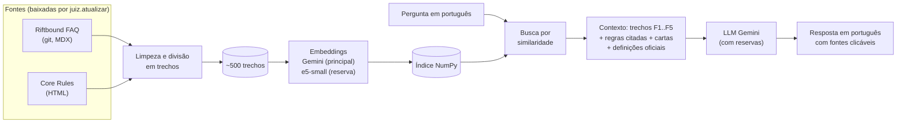

# Riftbound Juiz

Chatbot que funciona como **juiz de regras do Riftbound TCG** (o card game de League of Legends).
Você pergunta em português, ele responde rápido, cita a regra ou página usada (com link) e diz claramente quando não encontrou a resposta, em vez de inventar.

Por baixo, é um **RAG** (*Retrieval-Augmented Generation*): primeiro o app **busca** os trechos mais relevantes das regras e depois pede pra um LLM **responder usando só esses trechos**.

Junto com o juiz, um **deck builder**: minha coleção de cartas, os decks que eu cadastrei e os decks de torneio (meta), com quanto falta pra montar cada um, o custo estimado e a lista pronta pra comprar na Liga Riftbound.

É um **site** (Next.js, pensado primeiro pro celular) que conversa com uma **API** em Python (FastAPI): veja [O site (fase 3)](#o-site-fase-3). Sem cadastro pra usar, com um limite de perguntas por dia.

> Projeto pessoal e de portfólio de dados. Fase 1 (o juiz) e fase 2 (o deck builder) concluídas. Na fase 3, o app saiu do Streamlit e virou um site de verdade.

## Status

| Etapa | Descrição | Status |
|---|---|---|
| 1 | Estrutura do projeto + download e exploração do FAQ | ✅ concluída |
| 2 | Limpeza dos MDX e divisão em trechos (chunking) | ✅ concluída |
| 2b | Perguntas-gabarito em português (resposta e fonte esperadas) | ✅ concluída |
| 3 | Core Rules Document (CRD) oficial | ✅ concluída |
| 4 | Embeddings multilíngues + índice vetorial | ✅ concluída |
| 5 | LLM + geração da resposta (com glossário PT→EN) | ✅ concluída |
| 6 | Interface de chat (em Streamlit; hoje, no site da fase 3) | ✅ concluída |
| 7 | Avaliação completa (métricas de busca e de resposta) | ✅ concluída |
| 8 | Atualização automática + publicação | ✅ concluída |

**Fase 2: deck builder**

| Etapa | Descrição | Status |
|---|---|---|
| 1 | Catálogo de cartas no banco, coleção, importação manual de deck e % de conclusão | ✅ concluída |
| 2 | Decks do meta coletados automaticamente (API do TopDeck.gg) | ✅ concluída |
| 3 | Links, lista de compra e preço das cartas que faltam (Liga Riftbound), juiz falando dos meus decks | ✅ concluída |

**Fase 3: site de verdade**

| Etapa | Descrição | Status |
|---|---|---|
| 1 | Design no Figma (5 telas, celular primeiro, tema escuro) | ✅ concluída |
| 2 | API em FastAPI (juiz + deck builder) e site em Next.js + Tailwind, no lugar do Streamlit | ✅ concluída |
| 3 | Publicação: API no Render, site na Vercel (grátis) | ⏳ falta criar as contas e ligar (passo a passo abaixo) |

## Como funciona



Se nada parecido o bastante for encontrado, o juiz diz que não encontrou, sem chamar o LLM.

## Fontes de dados

| Fonte | O que é | Onde |
|---|---|---|
| **Riftbound FAQ** | FAQ não oficial com respostas explicadas e citação de regras, por Christian "Near" Ivicevic | [riftboundfaq.com](https://www.riftboundfaq.com) · [repositório](https://github.com/ChristianIvicevic/riftboundfaq) |
| **Core Rules Document (CRD)** | Regras oficiais da Riot. Versão atual: **v1.4 "Vendetta"**, de 16/07/2026 | [Rules Hub oficial](https://playriftbound.com/en-us/rules-hub/) · [PDF oficial](https://cmsassets.rgpub.io/sanity/files/dsfx7636/news_live/e9ac8e3d33e0f78cef296f5945aba7bc1313b086.pdf) · [versão HTML](https://www.riftboundfaq.com/reference/core-rules/1.4) (de onde o texto é lido) |

**Qual fonte vale mais:** o CRD vale mais que o FAQ não oficial. A exceção é quando um **FAQ oficial da Riot** diz explicitamente que tem precedência num ponto; isso acontece em 3 páginas do FAQ que citam o *Vendetta Rules FAQ*.

Os dados **não ficam no repositório**: são baixados pelos scripts pra `data/raw/` (que está no `.gitignore`).

## Estrutura do projeto

```
riftbound-juiz/
├── api/                    # API (fase 3): o que o site usa, em FastAPI
│   ├── main.py             # as rotas: perguntar, coleção, decks, meta
│   ├── acesso.py           # senha do dono (token) e limite dos convidados
│   ├── recursos.py         # carrega o juiz e o deck builder uma vez e recarrega uma vez por dia
│   └── gerar_explicacoes.py # escreve o "como usar" das cartas com um LLM local (Ollama)
├── web/                    # site (fase 3): Next.js + Tailwind, celular primeiro
│   ├── app/                # as telas: Juiz, Coleção, Meus decks, Detalhe do deck, Meta
│   ├── components/         # peças visuais (cartas, barras de progresso, navegação...)
│   └── lib/                # conversa com a API e a sessão (senha, preferências)
├── juiz/                   # código Python do projeto
│   ├── config.py           # caminhos, URLs das fontes, leitura do .env
│   ├── baixar_faq.py       # baixa/atualiza o FAQ (git sparse checkout)
│   ├── limpar_faq.py       # MDX -> trechos limpos com metadados (etapa 2)
│   ├── baixar_crd.py       # baixa o CRD em HTML, na versão que o FAQ marca como atual (etapa 3)
│   ├── limpar_crd.py       # HTML -> regras (pra consulta) e trechos (pra busca) (etapa 3)
│   ├── embeddings.py       # modelos que transformam texto em vetores (etapa 4)
│   ├── indice.py           # cria o índice (NumPy) e faz a busca (etapa 4)
│   ├── avaliar_busca.py    # compara os modelos usando o gabarito (etapa 4)
│   ├── glossario.yaml      # termos em português -> termo oficial em inglês (etapa 5)
│   ├── glossario.py        # acha os termos do glossário na pergunta (etapa 5)
│   ├── cartas.py           # texto oficial das cartas, com errata (etapa 5)
│   ├── llm.py              # LLM (Gemini) com modelos de reserva (etapa 5)
│   ├── responder.py        # o juiz: busca + contexto + instruções + LLM (etapa 5)
│   ├── definicoes.yaml     # termo técnico -> definição oficial (CRD e glossário do FAQ)
│   ├── erros.py            # aviso de cota diária esgotada
│   ├── perguntar.py        # pergunte pelo terminal (etapa 5)
│   ├── apresentacao.py     # citações viram links, créditos (etapa 6)
│   ├── registro.py         # guarda perguntas e 👍/👎 em data/logs/ (etapa 6)
│   ├── avaliar_respostas.py # avalia as respostas: métricas, avaliador LLM e revisão humana (etapa 7)
│   ├── atualizar.py        # baixa e processa FAQ e CRD e atualiza os índices, só o que mudou (etapa 8)
│   ├── limites.py          # modo convidado do app publicado: limites e senha (etapa 8)
│   └── fichas.py           # ficha da carta: texto, dúvidas do FAQ e explicação com exemplos (fase 3)
├── decks/                  # deck builder (fase 2), sem a API: só lógica e banco
│   ├── banco.py            # SQLite local ou Turso (SQLite na nuvem) pela API HTTP
│   ├── catalogo.py         # tabela mestre de cartas (card-catalog.json + runas) e nomes
│   ├── colecao.py          # minha coleção: quantidades, CSV e comandos no terminal
│   ├── importar.py         # lê a lista de deck em texto e confere as regras de construção
│   ├── meus_decks.py       # salva, lista e apaga decks
│   ├── meta.py             # decks de torneio pela API do TopDeck.gg (etapa 2)
│   ├── codigos.py          # código da carta (OGN-042) -> nome, pela galeria oficial da Riot
│   ├── compras.py          # links e lista de compra da Liga Riftbound (etapa 3)
│   ├── precos.py           # preço estimado: TCGplayer convertido pra reais (etapa 3)
│   ├── calibrar_precos.py  # mede a conversão com páginas salvas da Liga (etapa 3)
│   └── conclusao.py        # % de conclusão, cartas que faltam e ranking dos decks
├── avaliacao/
│   ├── gabarito.yaml       # perguntas-gabarito com resposta e fonte esperadas (etapa 2b; 45 na etapa 7)
│   ├── revisao_humana.csv  # 12 respostas com a nota de uma pessoa, às cegas (etapa 7)
│   └── resultados/         # resultados das avaliações de busca (etapa 4) e de resposta (etapa 7)
├── notebooks/
│   ├── 01_explorar_faq.ipynb   # exploração dos dados (etapa 1)
│   ├── 02_comparar_busca.ipynb # comparação dos modelos de busca (etapa 4)
│   └── 03_avaliar_respostas.ipynb # qualidade das respostas (etapa 7)
├── data/
│   ├── raw/                # dados como vieram da fonte (não versionado)
│   ├── processed/          # dados limpos e divididos em trechos (não versionado)
│   └── vetores/            # vetores da busca, sem o texto (versionado: o app publicado reaproveita)
├── tests/                  # testes automatizados (python -m pytest)
├── requirements.txt        # dependências da API (o que o Dockerfile instala)
├── requirements-dev.txt    # + notebooks, testes e comparações
├── Dockerfile              # a API num contêiner (Render)
├── render.yaml             # configuração da API no Render (plano grátis)
├── pytest.ini              # configuração dos testes
└── .env.example            # modelo do arquivo de chaves de API
```

## Como rodar

Requisitos: Python 3.12+, git e, pro site, Node.js 20+.

```powershell
# 1. Criar e ativar o ambiente virtual
python -m venv .venv
.venv\Scripts\Activate.ps1

# 2. Instalar as dependências (requirements-dev.txt inclui as do app e as de desenvolvimento)
pip install -r requirements-dev.txt

# 3. Baixar o FAQ e o CRD, dividir em trechos e montar os índices, tudo de uma vez.
#    Da 2ª vez em diante, só refaz o que mudou nas fontes.
python -m juiz.atualizar

# 4. Ligar a API (http://localhost:8000/docs mostra todas as rotas). Ela também roda o passo 3
#    sozinha, se os dados não existirem ou tiverem mais de um dia.
uvicorn api.main:app --reload --port 8000

# 5. Noutro terminal, ligar o site (http://localhost:3000). Na 1ª vez: copie web/.env.example
#    pra web/.env.local (o endereço da API) e instale as dependências com npm install.
cd web
npm install
npm run dev

# (Deck builder) Coleção pelo terminal, além do site
python -m decks.colecao exportar colecao.csv
python -m decks.colecao importar colecao.csv
python -m decks.colecao importar export_liga.csv --substituir   # coleção = exatamente o arquivo
python -m decks.colecao definir "Jinx, Rebel" 2

# (Deck builder) Decks de torneio do TopDeck.gg (precisa de TOPDECK_API_KEY no .env)
python -m decks.meta --forcar

# (Os passos do juiz.atualizar, um por um, se quiser ver cada parte)
python -m juiz.baixar_faq    # baixa só uns 0,7 MB, em vez dos mais de 200 MB do repositório inteiro
python -m juiz.limpar_faq    # -> data/processed/faq_trechos.jsonl
python -m juiz.baixar_crd
python -m juiz.limpar_crd    # -> data/processed/crd_regras.jsonl e crd_trechos.jsonl
python -m juiz.indice --buscar "posso usar emboscada na base?"

# (Ou perguntar pelo terminal)
python -m juiz.perguntar "o Guardian Angel salva minha unidade do Smite?"
python -m juiz.perguntar "posso usar emboscada na base?" --detalhes   # mostra a busca por dentro

# (Opcional) Refazer a comparação de modelos de busca (baixa uns 1,6 GB de modelos locais na 1ª vez)
python -m juiz.avaliar_busca

# (Opcional) Avaliar as respostas com o gabarito (gasta cota: 1 resposta + 1 nota do avaliador por pergunta)
python -m juiz.avaliar_respostas --modelo gemini-3.5-flash-lite
python -m juiz.avaliar_respostas --modelo gemini-3.8-flash --comparacao   # só 18 perguntas (cota de 20/dia)
python -m juiz.avaliar_respostas --concordancia flash-lite_e5             # revisão humana x avaliador

# Explorar os dados e ver as comparações
jupyter notebook notebooks/

# 6. Rodar os testes (Python) e conferir o site (tipos, lint e build)
python -m pytest
cd web; npm run lint; npm run build
```

A partir da etapa 4 é preciso uma chave grátis do Gemini: crie em [aistudio.google.com/apikey](https://aistudio.google.com/apikey), copie `.env.example` para `.env` e cole a chave em `GEMINI_API_KEY=`.
O tier grátis tem **cota diária**: 1.000 textos por dia no modelo de embeddings, e cada pergunta usa 1. A cota zera à meia-noite do horário do Pacífico, por volta das 4h ou 5h em Brasília.

## O que a exploração encontrou (etapa 1)

- **63 páginas MDX**: 49 de cartas, 7 de regras gerais, 6 de mecânicas e 1 "sobre o site". São umas 21 mil palavras no total.
- **183 perguntas** (`##`/`###`), todas com âncora, ou seja, com link direto. A maior tem 349 palavras, então cada pergunta cabe inteira num trecho.
- **1.134 citações de 408 regras diferentes** do CRD. É o que liga o FAQ às regras oficiais.
- **34 tipos de componente MDX** pra limpar (regras, cartas, termos, palavras-chave, custos, caixas de exemplo…).
- **7 avisos "Rules citation needed"**: respostas que o CRD ainda não sustenta por completo.

Detalhes e gráficos em [`notebooks/01_explorar_faq.ipynb`](notebooks/01_explorar_faq.ipynb).

## Como o FAQ vira trechos (etapa 2)

[`juiz/limpar_faq.py`](juiz/limpar_faq.py) gera **166 trechos**, um por pergunta (`##`). As subseções `###` entram no trecho da pergunta de cima, porque quase todas são continuação da resposta ("Steps", "Cost Sequence"…).

Os componentes MDX viram texto simples, e o que eles informam vira metadado:

| No MDX | No trecho | Metadado |
|---|---|---|
| `<Rule number="355.9.a" />` | `[CRD 355.9.a]`, só no texto do LLM | `regras` |
| `<Card name="Hextech Ray" />` | `Hextech Ray` | `cartas_mencionadas` |
| `<Term item="resolution">resolves</Term>` | `resolves` | — |
| `<Shield />`, `<QuickDraw />` | `[Shield]`, `[Quick-Draw]` | `palavras_chave` |
| `<Energy value={1} /><Fury />` | `[1][Fury]` (mesma notação do texto das cartas) | — |
| `<Steps><Step>…` | lista numerada `1. …` | — |
| `<Callout title="Example">…` | `Example: …` | `avisos`, `citacao_pendente` |

**Por que cada trecho tem dois textos?** O que é bom pra busca nem sempre é bom pra resposta:
- `texto` não tem números de regra e vai pros **embeddings**, porque números não ajudam a achar o significado da pergunta.
- `texto_com_regras` tem `[CRD 355.9.a]` no fim de cada frase e vai pro **LLM**, pra ele poder citar a regra exata.

Exemplo de trecho (`faq_trechos.jsonl`, resumido):

```json
{
  "id": "faq/general-rules/showdowns#showdown-close",
  "categoria": "general-rules", "pagina": "Showdowns", "carta": null,
  "pergunta": "When does a showdown close?",
  "url": "https://www.riftboundfaq.com/general-rules/showdowns#showdown-close",
  "texto_com_regras": "# Showdowns\n## When does a showdown close?\n\nA showdown closes only after every player passes focus in sequence without playing a spell or activating an ability. [CRD 347.2.a, 348]\n...",
  "regras": ["347.2.a", "348", "323.5", "346", "347.1"],
  "cartas_mencionadas": ["Stalwart Poro", "Ravenbloom Student", "Hextech Ray"],
  "palavras_chave": ["Shield"],
  "citacao_pendente": false,
  "crd_revisado": "1.4"
}
```

## Perguntas-gabarito (etapa 2b)

Pra saber se o juiz acerta, precisamos de perguntas com **resposta conhecida**.
[`avaliacao/gabarito.yaml`](avaliacao/gabarito.yaml) tem **28 perguntas em português**, cada uma com a resposta esperada, os trechos do FAQ onde ela está e as regras do CRD que a sustentam.

| Categoria | Quantas | Pra testar |
|---|---|---|
| Carta | 11 | dúvidas sobre uma carta específica |
| Regra geral | 6 | regras que valem pra qualquer carta (custos, chain, movimento…) |
| Mecânica | 4 | palavras-chave como Deathknell, Flow, Ambush |
| Só CRD | 3 | assuntos que o FAQ não cobre (tamanho do deck, pontos pra vencer, mulligan) |
| Fora do escopo | 4 | meta, preço, carta inventada e outro jogo: o bot deve dizer **"não encontrei"** |

As perguntas variam o **jeito de perguntar**: 11 formais, 10 informais ("se counterarem minha carta, recebo a mana de volta?") e 7 com **termos do jogo em português** ("atordoar", "Emboscada", "fase de compra"). Assim dá pra ver se a busca multilíngue entende o que o jogador quis dizer.

Na etapa 4, o gabarito vai medir **quantas vezes o trecho certo aparece entre os primeiros resultados da busca** (hit@k) pra cada modelo de embeddings.
Na etapa 7 ele cresceu pra **45 perguntas** (veja a seção da etapa 7).
Os testes em `tests/test_gabarito.py` conferem se todo trecho e regra citados existem de verdade, então se o FAQ mudar, o teste avisa.

## Como o CRD vira regras e trechos (etapa 3)

**De onde vem o texto:** o repositório do FAQ não guarda o CRD em formato estruturado (ele é gerado na hora de montar o site). O site, porém, publica o **CRD inteiro em HTML, com uma âncora por regra** (`#R355.9.a`) e as sub-regras aninhadas. Usamos essa página em vez de extrair texto do PDF, que dá muito mais trabalho e é fácil de errar. O **PDF oficial continua sendo a autoridade**: o próprio site avisa que o parsing pode ter erros, então o app sempre mostra o link dele.

**O que sai:**
- `crd_regras.jsonl`: **2.381 registros** (2.332 regras + 49 títulos de seção), um por número. Serve pra **consulta direta** ("qual o texto da 355.9.a?"), por exemplo quando um trecho do FAQ cita uma regra.
- `crd_trechos.jsonl`: **330 trechos** (mediana de 185 palavras), que vão pra **busca**.

**Como os trechos são montados:** o CRD é uma árvore (`355` → `355.9` → `355.9.a` → `355.9.a.1`), e a divisão segue os galhos:
- um galho que cabe em 250 palavras vira um trecho inteiro;
- um galho grande é dividido nos galhos filhos, e a regra "mãe" vai **resumida como contexto** em cada pedaço, porque muitas vezes a filha continua a frase dela ("...meets all of the following requirements:");
- regras pequenas vizinhas são agrupadas, pra não gerar trechos minúsculos;
- cada regra aparece em **exatamente um** trecho, e os testes garantem isso.

**Ponte FAQ ↔ CRD:** as **408 regras citadas pelo FAQ existem no CRD** processado, e as regras esperadas no gabarito também. É isso que vai permitir, na etapa 5, puxar o texto oficial de cada regra que um trecho do FAQ cita.

## Escolhendo o modelo de busca (etapa 4)

Os 496 trechos (166 do FAQ + 330 do CRD) foram transformados em vetores por cada candidato. Depois, cada pergunta do gabarito passou por uma busca, conferindo **em que posição aparece a fonte certa**. Os vetores ficam numa matriz **NumPy**, e a busca é um produto escalar. Com 500 trechos isso leva milissegundos, então não precisa de banco vetorial.

| Modelo | Fonte certa em 1º (hit@1) | Entre os 5 primeiros (hit@5) | Separa perguntas sem resposta? |
|---|---|---|---|
| **Gemini Embedding 2** ✅ escolhido | **100%** | **100%** | sim: notas ≤ 0,675 (sem resposta) × ≥ 0,718 (com resposta) |
| multilingual-e5-small | 88% | 100% | não |
| multilingual-e5-base | 79% | 92% | não |
| BM25 (palavra-chave) | 42% | 58% | — |
| Qwen3-Embedding-0.6B | descartado: levou mais de 20 min pra indexar no processador e usou 3,3 GB de RAM, mais que os 2,7 GB do Streamlit Cloud | | |

**O que os números mostram:**
- **Embeddings multilíngues são indispensáveis:** a busca por palavra-chave falha sempre que a pergunta em português não traz um termo em inglês.
- **A nota do Gemini serve de "termômetro":** um corte perto de **0,70** separou todas as perguntas sem resposta. É um **candidato** pra resposta "não encontrei", que ainda precisa ser confirmado com mais perguntas na etapa 7.
- **Amostra pequena:** são 24 perguntas com resposta, então diferenças de 1 ou 2 perguntas podem ser acaso.

Análise completa, com gráficos: [`notebooks/02_comparar_busca.ipynb`](notebooks/02_comparar_busca.ipynb).
O **e5-small** virou a **busca reserva**: entra automaticamente quando o Gemini falha. Os detalhes estão na seção da etapa 6.

## Como o juiz responde (etapa 5)

```
pergunta ─► glossário (termos PT → EN) ─► busca (Gemini Embedding 2, 5 trechos)
                                               │    └─ falhou (cota/sobrecarga/sem internet)? ─► reserva local (e5-small)
          nota do 1º resultado abaixo do corte da busca usada, e nenhuma carta citada? ──► "Não encontrei" (sem chamar o LLM)
                                               │
          contexto: trechos [F1..F5] + texto das cartas (com errata) + texto oficial das regras citadas pelo FAQ
                                               │
          LLM (Gemini 3.8 Flash → reservas 3.5 Flash / 3.5 Flash-Lite) ─► resposta em PT com [F1] e (CRD 355.9.a)
```

**Decisões, com o motivo:**
- **LLM: Gemini 3.8 Flash.** Tem tier grátis e usa a mesma chave dos embeddings. No tier grátis, os modelos mais novos às vezes ficam **sobrecarregados** (erro 503). Por isso o juiz tem **modelos de reserva** (3.5 Flash e 3.5 Flash-Lite), e um modelo que falhou fica 5 minutos de fora. Com isso, as respostas caíram de 15 a 30 s pra **cerca de 1,5 s** durante uma sobrecarga.
- **O glossário não entra na busca, só na resposta.** Medido com o gabarito, acrescentar os termos em inglês à pergunta **piorou** a busca do Gemini (hit@1 de 100% pra 92%). Os termos colados no fim, como "(Kill, Unit)", distorcem o sentido da pergunta. Na resposta, o glossário serve pra o LLM usar o termo oficial ("atordoar" → Stun).
- **Texto das cartas com errata.** Quando a pergunta cita uma carta, pelo nome completo ou pelo nome do campeão, o texto oficial dela entra no contexto. 9 das 63 erratas ainda não estavam aplicadas no catálogo, e o juiz aplica. Nomes curtos ou comuns, como "Vi" e "Buff", só contam com inicial maiúscula, pra "eu vi" não virar carta.
- **Regras citadas pelo FAQ entram com o texto oficial.** Assim o LLM vê a explicação do FAQ e a regra do CRD lado a lado, e sabe qual vale mais.
- **Instruções com "falsos amigos".** Numa resposta de teste, o LLM disse que Recall "volta pra mão", como no Legends of Runeterra. Em Riftbound, **Recall leva pra base** (CRD 455). As instruções agora trazem a definição oficial dos termos que mudam de sentido entre jogos.
- **Citações no formato `[F1]`.** O texto das cartas usa `[1]` pra custo de energia, e isso não pode ser confundido com a fonte 1.

**Amostra:** [`avaliacao/resultados/respostas_amostra_etapa5.md`](avaliacao/resultados/respostas_amostra_etapa5.md) tem 11 perguntas.
- As 8 com resposta foram respondidas certo e com fonte.
- As 3 fora do escopo (meta, carta inventada, outro jogo) receberam "Não encontrei" em menos de 1 segundo, sem chamar o LLM.
- A avaliação completa, com métricas, é a etapa 7.

## A interface (etapa 6)

> Até a fase 2, a interface era em Streamlit. Na fase 3 ela virou o site em `web/` (veja [O site (fase 3)](#o-site-fase-3)); o que está descrito aqui continua lá, com outro visual.

O chat, que também funciona no celular:
- **Resposta com links:** as citações `[F1]` abrem a página do FAQ na pergunta certa, e `(CRD 355.9.a)` abre a regra exata no Core Rules.
- **Fontes:** num painel que abre e fecha, primeiro as citadas e depois as só consultadas, com títulos curtos ("Smite — Can Guardian Angel... save a unit from Smite?").
- **Aviso de cautela** quando uma fonte tem "citação pendente" (o FAQ avisa que o CRD ainda não confirma tudo).
- **👍/👎 em cada resposta.** A pergunta, a resposta e a avaliação ficam em `data/logs/conversas.jsonl`, só na sua máquina e fora do git. As perguntas reais vão alimentar o gabarito da etapa 7.
- **Como funciona** (no botão ⓘ do chat):
  - versões das fontes (data do FAQ e versão do CRD);
  - "Como funciona", em 3 passos;
  - créditos e licença do FAQ (CC BY-SA 4.0);
  - aviso de que o projeto não é oficial da Riot.

**Ajustes feitos depois de ver o app funcionando:**
- **Fontes demais:** eram 10 por resposta, e agora são 3 a 5. Só entram as cartas citadas na pergunta e as das páginas do FAQ com nota perto da melhor, e trechos abaixo do corte de 0,70 saem do contexto.
- **Citação misturada:** `[F1, CRD 372]` (fonte e regra no mesmo colchete) passou a ser entendida.
- **Exemplos:** as perguntas de exemplo somem depois da primeira pergunta.

Os testes usam um juiz "de mentira" e conferem o que a API devolve (`tests/test_api.py`), sem gastar cota.

### Ajustes depois do primeiro uso real

As primeiras perguntas feitas no app mostraram três problemas que o gabarito não pegava:

1. **"Não encontrei" em perguntas de definição.** "O que é open state?" e "o que é priority?" receberam "não encontrei", **mesmo com a regra certa em 1º lugar na busca**. Perguntas curtas desse tipo têm nota de 0,66 a 0,70, abaixo do corte de 0,70 que tinha vindo do gabarito, e o gabarito não tinha nenhuma pergunta assim. Como essas notas se misturam com as de perguntas fora do escopo, nenhum corte separa os dois grupos. O corte caiu pra **0,60**, e agora só barra o que é claramente sem relação; na faixa cinzenta, quem decide é o LLM.
2. **Respostas técnicas demais pra quem está aprendendo.** "Me explique as chains" começava com "Depende." e despejava regras. Agora, perguntas de explicação ("o que é", "explique", "não entendi") recebem uma definição simples e um exemplo de jogo. Também entrou uma fonte nova, o **glossário para iniciantes do FAQ**, com 7 termos (Chain, Pending, Finalization, Resolution, Priority, Cleanup e Focus). Na busca, ele aparece em 1º lugar pra "o que é priority?" e "me explique as chains".
3. **Cota diária do tier grátis.** O Gemini Embedding 2 aceita **1.000 textos por dia**, e cada trecho indexado conta como um. Recriar o índice inteiro gastava metade da cota do dia. Duas mudanças:
   - **Indexação incremental:** só os trechos novos ou alterados vão pra API. Acrescentar o glossário custou 7 textos, e não 503.
   - **Aviso claro:** quando a cota acaba, o app avisa que ela só volta no dia seguinte, em vez de ficar tentando.
   - **Busca reserva local:** quando o Gemini falha (cota do dia, sobrecarga ou sem internet), a busca passa pro **multilingual-e5-small**, que roda no computador. Ele achou a fonte certa entre os 5 primeiros em 100% do gabarito da etapa 4.
     - **Corte próprio:** cada modelo tem sua escala de nota, então o corte do "não encontrei" é 0,60 no Gemini e 0,78 no e5-small.
     - **Os dois índices andam juntos:** `python -m juiz.indice` atualiza os dois de uma vez.
     - **Aviso na tela:** quando a resposta usa a reserva, o app mostra uma linha discreta dizendo isso.
     - **Primeiro teste real:** foi com a cota do Gemini esgotada. As 4 perguntas do uso real foram respondidas pela reserva, com a primeira levando ~20 s (carrega o modelo) e as seguintes ~1,5 s.
     - **Custo pra etapa 8:** o app publicado vai precisar do PyTorch pra rodar a reserva.
     - **Na fase 3, a reserva local saiu da API publicada:** o servidor grátis (Render) tem 512 MB de memória, e só o PyTorch passa disso. Publicada, a API usa só a busca do Gemini; no seu computador, com `requirements-dev.txt`, a reserva continua funcionando. Se a busca do Gemini falhar lá (ex.: cota do dia), o juiz avisa que não conseguiu responder.

### Conversa com memória e respostas mais didáticas

O uso real mostrou dois problemas: as respostas eram superficiais e difíceis de entender, e o juiz não lembrava da pergunta anterior. As mudanças:

- **Memória da conversa.** O juiz recebe as últimas 3 trocas, então dá pra perguntar "e se for durante um showdown?". Na busca, uma pergunta de continuação também é procurada junto com a pergunta anterior, porque sozinha ela não diz do que se trata. "Nova conversa" zera tudo. No terminal, `python -m juiz.perguntar --chat` abre o mesmo modo.
- **Dois tipos de resposta.** O juiz reconhece pedidos de explicação ("o que é", "como funciona", "explique", "não entendi"):
  - **Explicação:** estrutura fixa com **Em resumo**, **Passo a passo**, **Exemplo** e **Termos que apareceram**, até ~350 palavras, usando 8 trechos em vez de 5.
  - **Pergunta direta:** "Sim/Não/Depende", o porquê em linguagem simples e um exemplo, se ajudar.
- **Definições oficiais dos termos técnicos.** Pedir que o LLM explicasse os termos teve um efeito colateral: ele passou a **inventar** definições (definiu Open State como "quando os jogadores têm prioridade", mas a regra 309.2 diz "quando não existe Chain"). Agora, quando um termo técnico aparece, o juiz manda junto a **definição oficial**: o texto do Core Rules e do glossário do FAQ, listado em [`juiz/definicoes.yaml`](juiz/definicoes.yaml). A instrução proíbe inventar outras e pede os nomes oficiais: "unidade", nunca "lacaio".
- **Citações discretas.** `[F1][F2][F3]` no meio do texto virou um número pequeno sobrescrito com link, como nota de rodapé. Antes, o texto do LLM passa por *escape* de HTML, pra ele não conseguir injetar código na página.

**Limite do tier grátis que afeta a qualidade:** o Gemini 3.8 Flash e o 3.5 Flash aceitam só **20 respostas por dia cada** no tier grátis. Depois disso, quem responde é o 3.5 Flash-Lite, que é mais fraco.

## Avaliando as respostas (etapa 7)

A etapa 4 mediu só a busca. Aqui medimos a **resposta final**, que é o que o usuário lê.

**O gabarito cresceu de 28 pra 45 perguntas:**
- **9 perguntas reais**, tiradas do uso do app, a maioria sobre *timing* ("se eu jogo uma spell e meu oponente passa, eu tenho que passar também?");
- **6 de definição** ("o que é open state?");
- **2 continuações de conversa**, que só fazem sentido com a pergunta anterior;
- **3 novas fora do escopo**, incluindo perguntas sobre outros jogos.

Nas perguntas de sim ou não, o gabarito também guarda a **conclusão esperada**.

**Três jeitos de medir** ([`juiz/avaliar_respostas.py`](juiz/avaliar_respostas.py)):
1. **Métricas automáticas**, objetivas:
   - o juiz respondeu quando devia e disse "não encontrei" quando devia?
   - a 1ª palavra (Sim/Não/Depende) bate com a esperada?
   - citou a fonte certa?
   - citou alguma regra que não existe?
2. **Avaliador LLM:** o Gemini 3.5 Flash-Lite compara cada resposta com a esperada e dá **correta / parcial / incorreta**, numa resposta em JSON com formato fixo (pydantic).
3. **Revisão humana às cegas:** 12 respostas lidas por uma pessoa, sem ver a nota do avaliador, pra medir **o quanto dá pra confiar nele**.

**Rodada 1, com as duas reservas** (busca e5-small + Gemini 3.5 Flash-Lite, o pior caso do juiz):

| Métrica | Resultado |
|---|---|
| respostas corretas (avaliador) | **89%** (40 de 45) |
| conclusão certa nas perguntas de sim/não | **81%** (17 de 21) |
| citou a fonte certa | **97%** |
| citações inventadas | **0** |
| "não encontrei" por engano | **0** em 38 |
| recusou as perguntas fora do escopo | 6 de 7 |
| tempo por resposta (mediana) | 1,6 s |

**O que a avaliação mostrou:**
- **O erro mais comum é a 1ª palavra.** Às vezes o juiz abre com "Sim" onde o certo é "Não" ou "Depende", mesmo quando a explicação depois está certa.
  - Exemplo: "Posso usar Emboscada pra jogar uma unidade na base?" → "Sim, com o timing normal". O certo é **Não**: o Ambush não vale na base.
  - Pra um iniciante, que muitas vezes lê só o começo, isso é grave.
- **Timing da Chain e da prioridade é o ponto fraco**, tanto na busca quanto na resposta.
- **O avaliador LLM serve como filtro, não como juiz final.** Ele concordou com a revisão humana em 6 de 12 respostas. Nas 6 divergências, o texto das regras deu razão ao avaliador em 3 e ao humano em 2; a última depende do gabarito.
  - Quando o avaliador diz "correta", é confiável: o humano concordou em 6 de 7.
  - Quando aponta problema, vale uma pessoa conferir. Ele cobra detalhes que a pergunta não pediu e deixa passar erros sutis de regra.
- **O corte do "não encontrei" não separa bem no e5-small:** as notas das perguntas fora do escopo se misturam com as das legítimas. O corte de 0,78 ficou como rede de segurança, e quem recusou as perguntas fora do escopo foi o LLM, seguindo as instruções.

### Ajustes a partir do diagnóstico (rodada 2)

1. **Prompt:** Sim/Não/Depende só em pergunta de sim ou não, e a 1ª palavra responde exatamente o que foi perguntado.
   - O exemplo no prompt é genérico, e não uma pergunta do gabarito. Colocar o gabarito no prompt melhoraria o número sem melhorar o juiz.
2. **Definições oficiais do *timing*:**
   - Pass: quem recebe a prioridade e por que a Chain resolve (CRD 337.4 e 339.1);
   - Priority: quando cada jogador recebe a prioridade (CRD 312.2);
   - Finalize: Unit e Gear resolvem na hora (CRD 337.2).
3. **Avaliador:** julga só o que a pergunta pede.
4. **Gabarito da q44** ("deck bom de Jinx"): aceita as regras de construção, desde que o juiz diga antes que estratégia não está nas regras.

| Métrica | Rodada 1 | Rodada 2 |
|---|---|---|
| conclusão certa (sim/não) | 81% | 95%\* |
| citou a fonte certa | 97% | 95% |
| citações inventadas | 0 | 0 |
| "não encontrei" por engano | 0 de 38 | 1 de 38 |
| recusou as fora do escopo | 6 de 7 | 7 de 7 |
| concordância do avaliador com a revisão humana | 50% | 67% |

\* **Uma rodada só engana.** Repetindo 4 vezes as perguntas-problema com o prompt novo:
- a da Emboscada acertou **4 de 4** (corrigida de verdade);
- outras três oscilaram (1 ou 2 de 4), porque o LLM não responde sempre igual.

A melhora real fica entre 81% e 95%. Pra decisões importantes, cada pergunta precisa ser feita várias vezes.

A rodada 2 também revelou um bug na própria métrica: "Não encontrei" contava como a conclusão "não". Ele foi corrigido.

Análise completa, com gráficos, a tabela de divergências e o antes × depois: [`notebooks/03_avaliar_respostas.ipynb`](notebooks/03_avaliar_respostas.ipynb).
**O que ficou de fora:** a comparação com o modelo principal (Gemini 3.8 Flash) e a busca Gemini no gabarito de 45 perguntas. O tier grátis do 3.8 Flash dá só 20 respostas por dia, e a cota e a sobrecarga não deixaram rodar. A avaliação foi encerrada com o Flash-Lite, o pior caso do juiz. A etapa 8 ainda comparou o Flash-Lite com os modelos do Groq (veja abaixo).

## Atualização e publicação (etapa 8)

### Atualização automática

`python -m juiz.atualizar` faz o caminho inteiro e só trabalha onde algo mudou:
1. atualiza o FAQ com git e compara o commit;
2. refaz os trechos se o FAQ mudou;
3. baixa o CRD na versão que o FAQ marca como atual, e só reprocessa se o conteúdo mudou;
4. atualiza os dois índices de busca, mandando pro modelo só os trechos novos ou alterados.

O app chama a mesma função quando sobe e depois uma vez por dia. Se a internet falhar, ele segue com os dados que já tem.

### Vetores publicados sem o texto

A pasta `data/` não vai pro GitHub: o texto do Core Rules e das cartas é material da Riot. Por isso, o app publicado **monta os dados sozinho a partir das fontes** ao subir, e isso leva ~25 s.

O problema era a busca: refazer os vetores do Gemini a cada vez que o app sobe gastaria metade da cota diária de embeddings (503 dos 1.000 textos).
- A solução é `data/vetores/`. Ela guarda os vetores com o id e uma "assinatura" (hash) de cada trecho, **sem o texto**, e vai pro GitHub.
- Ao subir, o app reaproveita todo vetor cuja assinatura bate e só manda pro modelo os trechos novos.
- Numa simulação do zero (sem `data/`, sem `.env`), o app baixou tudo e reaproveitou os 503 vetores, com **0 textos enviados à API**.

Depois de rodar `juiz.atualizar` com fontes novas, faça commit de `data/vetores/` pro app publicado aproveitar.

### Quando o Gemini está sobrecarregado: Groq e plano B

Publicado, o app falhava com frequência: no plano grátis, o Google recusa pedidos em horário de pico (erro 503, "high demand"). Num teste, o 3.8 Flash, o 3.7 Flash, o 3.5 Flash-Lite e o 3.1 Flash-Lite deram 503 ao mesmo tempo, e só o 3.5 Flash respondeu, depois de 27 s.

**Por que não um LLM rodando no próprio servidor:** o servidor grátis tem 2 processadores, sem placa de vídeo. Um modelo que cabe na memória levaria de 1 a 2 minutos por resposta e erraria mais que o Gemini. Servidores grátis com mais memória também não têm placa de vídeo, então o problema de velocidade continua.

**Duas camadas de proteção:**
1. **Groq como reserva de outra empresa.** Quando os três Gemini falham, a resposta vem de um modelo aberto no Groq (`config.MODELO_GROQ`), que tem capacidade própria.
   - Plano grátis: ~1 pergunta por minuto e ~40 por dia. Como reserva, basta.
   - Só entra se `GROQ_API_KEY` estiver no `.env` ou nos secrets.
   - **Qual modelo:** os dois modelos grátis do Groq foram comparados com o Flash-Lite nas 18 perguntas de `config.IDS_COMPARACAO`, com a mesma busca (e5-small):

     | | Gemini 3.5 Flash-Lite | **Groq gpt-oss-120b** ✅ | Groq qwen3.8-27b |
     |---|---|---|---|
     | conclusão (Sim/Não/Depende) certa | 91% (10/11) | **91% (10/11)** | 64% (7/11) |
     | citou a fonte certa | 93% | 87% | 73% |
     | citações inventadas | 0 | 0 | 0 |
     | respostas vazias | 0 | 0 | **4 de 17** |
     | tempo (mediana) | 2,8 s | **1,7 s** | 3,4 s |

   - O Qwen tem um limite de 1.000 tokens de **saída** por minuto no plano grátis. O raciocínio escondido gastava esse limite inteiro, e a resposta vinha vazia.
   - Pior: o avaliador (Flash-Lite) deu "correta" pras 4 respostas vazias. Agora a avaliação dá "incorreta" pra resposta vazia sem nem chamar o avaliador, e o app trata resposta vazia como falha e passa pra próxima reserva.

2. **Plano B sem LLM.** Se nenhum LLM responder, o app mostra os 3 trechos das regras que a busca achou, em inglês e com link, e explica o motivo. A busca funciona mesmo sem o Gemini, graças ao e5-small.
   - Essa resposta não conta no limite do convidado.

### Proteção: modo convidado + senha

A chave de API fica nos *secrets* do servidor da API e nunca vai pro navegador; o visitante nunca a vê. O risco real é outro: alguém gastar a cota **grátis** do dia e o app parar até o dia seguinte. Com o projeto do Google **sem faturamento ativado**, o custo máximo continua zero.

| Quem | O que pode |
|---|---|
| **Convidado** | 10 perguntas por dia por visitante (pelo IP) e 100 por dia, somando todos (`config.LIMITE_POR_VISITANTE` e `LIMITE_DIARIO`); só vê a coleção e os decks |
| **Com a senha** | uso sem limite e edição da coleção e dos decks (5 senhas erradas por IP por hora, comparação em tempo constante) |

No site, a senha fica no cadeado do topo. A API devolve um **token assinado** com a própria senha (HMAC), que o navegador guarda por 30 dias; trocar a senha desconecta todo mundo.

O modo convidado só liga quando `SENHA_DO_APP` existe. No seu computador, sem ela, não há limite.

Limitações conhecidas:
- quem usa a mesma rede (mesmo IP) divide o limite do visitante; quem protege a cota de verdade é o limite diário;
- os contadores ficam na memória do servidor e zeram se a API reiniciar.

**Privacidade:** no plano gratuito, o Google pode usar as perguntas pra melhorar os produtos dele, e pessoas podem revisá-las. O app avisa isso na tela. No app publicado, o registro das conversas em arquivo fica desligado.

### Como publicar

A publicação mudou na fase 3: veja [Como publicar (grátis)](#como-publicar-grátis-api-no-render-site-na-vercel).

## Deck builder (fase 2)

As telas **Coleção**, **Meus decks** e **Meta** do site respondem à pergunta "quais decks eu consigo montar com as cartas que tenho?".

### Etapa 1: coleção, importação de decks e conclusão

- **Minha coleção:** uma grade com as 935 cartas (as 929 do catálogo do FAQ + 6 runas básicas), com a arte de cada uma, busca pelo nome ou pelo campeão, filtros por tipo e domínio e botões + e −. As mudanças só são gravadas no botão **Salvar**, e não a cada toque. Dá pra importar e exportar em CSV (colunas `carta` e `quantidade`, com vírgula ou ponto e vírgula, como o Excel em português salva).
- **Exportação da Liga Riftbound:** o CSV de coleção que a [Liga Riftbound](https://ligariftbound.com.br) exporta entra direto. O nome vem da coluna `Card (EN)`, e as várias linhas da mesma carta (uma por qualidade, idioma ou foil) somam. Com a opção **substituir a coleção inteira**, a coleção passa a ser exatamente a do arquivo, então uma carta vendida some daqui também. Numa coleção real de 81 linhas, as 70 cartas foram reconhecidas, inclusive "Shen - Kinkou", "Jayce - Defender of Tomorrow" e "Kayle, Justified (Overnumbered)".
- **Importar um deck:** cole a lista exportada por um site de decks. Aceita `3 Carta`, `3x Carta` e `Carta x3`, com ou sem cabeçalhos de seção (`Legend:`, `Main Deck:`, `Runes:`, `Sideboard:`… ou em português). Sem cabeçalho, a seção vem do tipo da carta.
- **Porcentagem de conclusão:** conta cópias. Com 1 de 3 Jinx, Rebel, faltam 2. Cópias a mais não passam de 100%, o sideboard fica de fora por padrão e as runas básicas podem contar como "tenho" (quase todo jogador tem as de um deck inicial). Os decks aparecem do mais fácil pro mais difícil de montar, e cada um mostra a tabela do que falta.

**Decisões, com o motivo:**
- **Por que Streamlit no começo:** mantinha o projeto numa linguagem só e já estava publicado. Pra não ficar preso a ele, **toda a lógica ficou em `decks/`, sem tela** (um teste confere isso). Foi o que deixou a troca pelo site da fase 3 mexer só na interface.
- **Nomes das cartas:** o catálogo tem só o título das lendas ("Loose Cannon", com a tag Jinx), mas os sites escrevem "Jinx, Loose Cannon" ou "Jinx - Loose Cannon". Os dois viram apelidos da lenda. Caixa, acento, apóstrofo curvo e um código de coleção no fim (`(OGN-202)`) também não atrapalham.
- **Nome não reconhecido não é adivinhado:** o app mostra as cartas parecidas ("quis dizer Jinx, Rebel?") e não salva até a lista ser corrigida (ou até você pedir pra salvar sem elas). Trocar uma carta por outra "parecida" daria uma conta de conclusão errada.
- **Regras de construção só avisam:** o app confere a lista com o Core Rules (CRD 103.2: 1 lenda, deck principal com pelo menos 40 cartas contando o campeão escolhido, até 3 cópias por nome, 12 runas), mas salva mesmo assim, porque um deck em construção pode estar incompleto de propósito.
- **Cada deck guarda a origem** (link, data, torneio e colocação). Na importação manual, só o nome e o link são usados; os outros campos já estão prontos pros decks do meta da próxima etapa.

### Onde a coleção fica: Turso (SQLite na nuvem)

As tabelas (`cartas`, `colecao`, `decks`, `deck_cartas`) são SQLite. Com `TURSO_DATABASE_URL` e `TURSO_AUTH_TOKEN` no `.env` ou nos secrets, elas ficam no [Turso](https://turso.tech), um SQLite na nuvem com plano grátis. Sem as duas variáveis, ficam em `data/decks.sqlite`, no seu computador (fora do git).

- **Por que um banco na nuvem:** o disco do servidor grátis da API é apagado a cada reinício, e a coleção sumiria junto.
- **Por que falar com o Turso pela API HTTP**, e não pelo pacote oficial: o pacote é nativo (Rust) e já teve problema de instalação no Windows. A API é um POST com JSON, e o `httpx` já era dependência do projeto. Cada gravação (ex.: salvar a coleção) vai numa **transação**: ou tudo vale, ou nada.
- **Economia de cota:** o catálogo só é regravado no banco quando muda (o app guarda uma assinatura dele), e a tela de decks faz uma consulta só pra todos os decks.
- **Quem pode editar:** no site publicado, o visitante só vê a coleção e os decks; salvar, importar e apagar pedem a mesma senha do juiz. Se o Turso não estiver configurado, a tela da coleção avisa que o que for salvo vai sumir.

**Como configurar no app publicado:**
1. Crie uma conta grátis em [turso.tech](https://turso.tech) e um banco (`turso db create riftbound-decks`).
2. Pegue a URL (`turso db show riftbound-decks --url`) e crie um token (`turso db tokens create riftbound-decks`).
3. Cole os dois nos secrets do Space da API como `TURSO_DATABASE_URL` e `TURSO_AUTH_TOKEN`. Pra usar o mesmo banco no seu computador, cole também no `.env`.

**Testes:** o banco local roda em memória, e o Turso é testado com um servidor falso que confere o JSON enviado e a leitura da resposta. A conexão com um banco Turso de verdade ainda precisa ser conferida depois de criar o banco (passos acima).

### Etapa 2: decks do meta

A aba **Decks do meta** mostra os decks que ficaram entre os 8 primeiros em torneios de Riftbound dos últimos 30 dias, do mais fácil pro mais difícil de montar com a sua coleção, com filtro por lenda e link pro torneio.

- **Fonte: a API oficial do TopDeck.gg**, que é grátis (com uma chave gratuita) e traz os torneios com as listas dos jogadores. O riftools.app, a primeira ideia, não tem API, e não deu pra conferir os termos de uso dele; ler o HTML de um site pode quebrar a qualquer mudança.
- **Atualização:** o app coleta sozinho quando a última coleta tem mais de 7 dias; quem tem a senha também pode clicar em **Atualizar agora**. Pelo terminal: `python -m decks.meta --forcar`. Cada coleta **substitui** os decks do meta anteriores, numa transação só; os decks que você importou não mudam. Uma coleta vazia não apaga nada.
- **Filtros:** só torneios com pelo menos 8 jogadores e só o top 8 de cada um (`config.META_MIN_JOGADORES` e `META_TOP_POR_TORNEIO`). A página mostra os 20 decks mais fáceis de montar.
- **Cartas pelo código:** a API manda o código de cada carta (ex.: OGN-042), e o app acha a carta por ele; o nome fica de reserva (veja abaixo). Um deck com carta não reconhecida fica de fora, em vez de entrar com a conta errada, e o nome aparece no relatório da coleta.
- **Privacidade:** o nome dos jogadores não é guardado; só o torneio, a data, a colocação e o link.
- **Como ligar:** crie uma chave grátis na sua conta do [TopDeck.gg](https://topdeck.gg) e ponha em `TOPDECK_API_KEY`, no `.env` e nos secrets do app publicado.

### Código da carta × nome

Nas importações, o **código** (OGN-042, VEN-R04) é a forma mais segura de saber qual é a carta: não depende de como o nome foi escrito ("Jinx - Loose Cannon", "Kayle, Justified (Overnumbered)"). A API do TopDeck.gg manda o código, e o CSV da Liga também (colunas `Edicao (Sigla)` e `Card #`). Então o app tenta o código primeiro e o nome depois.

A **coleção e os decks continuam guardados pelo nome**: um deck pede "Jinx, Rebel", e qualquer impressão serve. A normal, a foil, a de arte alternativa (OGN-202a) e a overnumbered têm códigos diferentes e o mesmo nome.

- **De onde vêm os códigos:** o catálogo do FAQ não tem. Eles vêm da [galeria de cartas oficial da Riot](https://riftbound.leagueoflegends.com/en-us/card-gallery/), baixada uma vez por semana pra `data/raw/galeria_cartas.json` ([`decks/codigos.py`](decks/codigos.py)). Nos campeões, a galeria dá só "Jinx" como nome; o nome completo vem do texto de acessibilidade da imagem ("Riftbound Unit: Jinx, Rebel. ...").
- **Conferido com dados reais:** as 1.189 impressões da galeria ganharam código, e as 81 linhas do CSV da Liga deram a mesma carta pelo código e pelo nome.
- **Se a galeria falhar** (fora do ar ou mudou de formato), tudo continua funcionando pelo nome, como antes.

**Limite conhecido:** a galeria da Riot, a documentação e a API do TopDeck.gg não abriam no ambiente onde o código foi escrito. O formato das respostas foi conferido no código de um projeto aberto que usa a API em produção, e os testes usam um servidor falso nesse formato. A primeira coleta real mostra no relatório quantos decks entraram e quais cartas não foram reconhecidas.

### Etapa 3: comprar o que falta e o juiz falando dos meus decks

**Comprar o que falta (Liga Riftbound).** Em cada deck, a tabela do que falta ganhou:
- **link pra carta na Liga**: com o código da carta, o link vai direto na impressão certa (`Jinx - Loose Cannon (251)`, coleção OGN), no mesmo formato da Liga; sem o código, vai pelo nome;
- **lista de compra** no formato "3 Nome", pra copiar (ou baixar em .txt) e colar na [Compra por Lista da Liga](https://www.ligariftbound.com.br/?view=cards/lista), que monta o carrinho mais barato entre as lojas. É o "carrinho geral" que o plano pedia;
- **custo estimado pra completar** o deck (veja abaixo). Só o total: carta a carta a estimativa erra muito, mas na soma os erros se compensam (numa conferência real, a soma ficou a uns R$ 10 do total da Liga).

**Decks mais baratos de completar.** A barra lateral tem **Ordenar os decks**: "Mais barato de completar" (padrão, pelo custo estimado do que falta, e o custo aparece na barra de progresso de cada deck) ou "Menos cartas faltando" (pelo número de cópias que ainda faltam). Deck com carta sem preço vai depois dos que têm a conta completa. Vale pros seus decks e pros do meta.

Os campeões vão pra Liga como "Ezreal - Prodigy": com a vírgula, a página não abre. E o link usa a impressão normal da carta, e não a overnumbered: a lenda da Vi é a UNL 187, e não a UNL 229.

**Preço estimado: TCGplayer convertido pra reais, calibrado com a Liga.** A primeira ideia era ler o preço na própria Liga, mas ela barrou os pedidos já na 1ª carta (proteção anti-robô), e os preços de cada loja aparecem como imagens embaralhadas. Não contornamos isso. O preço de verdade continua a um clique, no link da carta e na Compra por Lista.

A estimativa usa o preço de mercado do TCGplayer (EUA), de uma cópia diária e pública no GitHub ([rleutz/riftbound-prices](https://github.com/rleutz/riftbound-prices), que lê o [tcgcsv.com](https://tcgcsv.com)), atualizada no app uma vez por semana. As cartas vêm por código, e das várias impressões vale a mais barata. O valor em dólar vira uma **estimativa do menor preço na Liga**, calibrada assim:
- 23 páginas de carta salvas da Liga em 25/09/2026, com menor preço entre R$ 0,07 e R$ 229,90, comparadas com o TCGplayer de 24/09 ([`avaliacao/precos_liga_calibracao.csv`](avaliacao/precos_liga_calibracao.csv));
- o menor anúncio da Liga segue **duas faixas**:
  - **cartas baratas** (até US$ 0,50): R$ 1,67 por dólar. O anúncio mais barato é de "bulk" e sai quase pelo número do preço em dólar (a Bushwhack, US$ 0,06, sai por R$ 0,07);
  - **cartas caras** (a partir de US$ 2,50): R$ 9,51 por dólar;
  - entre as duas, a razão sobe aos poucos (interpolação), sem salto. A amostra não tem cartas nessa faixa, então ali a estimativa não foi medida;
- com uma razão fixa, o erro era de 80%. Com as duas faixas, o **erro medido** deixando cada carta de fora do ajuste fica em **33% numa carta** e **20% na soma de 10 cartas**, porque os erros de uma carta pra outra se compensam em parte. A estimativa serve mais pro custo do deck do que pro preço de uma carta. Alguns casos se afastam muito: a Carnivorous Snapvine (US$ 0,31) tem o menor anúncio da Liga a R$ 9,00.

A tela mostra a data da cópia, a razão e o erro junto com o custo. Pra recalibrar (ex.: se o dólar mudar muito), salve páginas de carta da Liga numa pasta e rode `python -m decks.calibrar_precos pasta/`.

**O juiz falando dos meus decks.** No chat, o seletor **Deck em foco** mostra, com os decks do deck builder (os seus primeiro, depois os do meta). Com um deck escolhido, o juiz recebe a lista e o texto oficial de cada carta como mais uma fonte, então dá pra perguntar "quais cartas do meu deck dão Stun?" ou "o que acontece se eu jogar a Jinx, Rebel com o Super Mega Death Rocket!?". Com deck em foco, o atalho do "não encontrei" (busca fraca) não vale, porque a resposta pode estar nas cartas do deck.


### Próximos passos

O plano da fase 2, com o que já foi feito:

1. ✅ **Cadastro da minha coleção** de cartas, usando o `card-catalog.json` do repositório do FAQ como tabela mestre.
2. ✅ **Decks do meta já prontos no app**, coletados automaticamente uma vez por semana pela API do TopDeck.gg, com origem (link), data, torneio e colocação.
3. ✅ **Importação manual** de um deck específico, colando a lista no formato de texto que os sites exportam.
4. ✅ Para cada deck, **porcentagem de conclusão e cartas que faltam** (deck menos coleção), com banco **SQLite** (Turso na nuvem).
5. ✅ **Sugestão de decks**: os decks (meus e do meta) ordenados do mais barato pro mais caro de completar, pelo custo estimado, ou pelos que têm menos cartas faltando.
6. ✅ Para cada carta que falta, **link direto** na [Liga Riftbound](https://ligariftbound.com.br) e a lista pra **Compra por Lista** (o carrinho geral). A [MYP Cards](https://mypcards.com/riftbound) ficou de fora (formato da busca desconhecido).
7. ✅ **Preço das cartas que faltam**, estimado pelo TCGplayer e calibrado com o menor preço da Liga (erro medido na tela).
8. ✅ **Telas próprias** pro deck builder, e o juiz responde dúvidas sobre as cartas dos meus decks (Deck em foco).

## O site (fase 3)

O Streamlit limitava o visual e a experiência no celular. Na fase 3, o app virou um site de verdade, desenhado antes no [Figma](https://www.figma.com/design/lXPI99tYoOrf3jwH5SXkoy) e trocado de uma vez.

```
Navegador ──> site (Next.js, na Vercel) ──> API (FastAPI, no Render) ──> Gemini / Groq
                                                   │
                                                   └──> Turso (coleção e decks), TopDeck.gg, galeria da Riot
```

- **Site (`web/`):** Next.js + Tailwind, pensado primeiro pro celular (barra de navegação embaixo, janelas que sobem de baixo) e com tema escuro nas cores do Riftbound (dourado, azul e as cores dos domínios). Títulos em Cinzel e texto em Inter.
  - **Juiz:** o chat, com o Deck em foco, as citações com link, as fontes e o plano B. A conversa fica guardada na aba do navegador.
  - **Coleção:** grade de cartas com a arte oficial, + e −, filtros por tipo e domínio e importação do CSV da Liga.
  - **Meus decks:** só os decks que você cadastrou, na ordem "mais barato de completar" ou "menos faltando", com o custo estimado.
  - **Detalhe do deck:** o que falta, com link de cada carta na Liga, e a lista pronta pra copiar e colar na Compra por Lista.
  - **Meta:** os decks de torneio, com filtro por lenda.
  - **Ficha da carta:** tocar em qualquer carta abre a ficha dela: a arte grande (toque de novo pra tela cheia), o texto oficial com as palavras-chave em destaque, **como usar** (o que a carta faz, exemplos de jogada e os cuidados, citando o FAQ), as **dúvidas do FAQ** sobre ela e as páginas das mecânicas do texto, com link, e um atalho pra perguntar ao juiz sobre a carta. Os battlefields, que têm arte deitada, aparecem girados nas grades pra caber.
- **API (`api/`):** FastAPI por cima dos pacotes `juiz/` e `decks/`, que não mudaram. A documentação de todas as rotas fica em `/docs`. O juiz e o deck builder carregam uma vez quando a API liga e se atualizam sozinhos uma vez por dia, sem parar os pedidos.
- **Explicações das cartas ("como usar"), sem gastar o Gemini:** são escritas de antemão por um LLM que roda no seu computador, pelo [Ollama](https://ollama.com) (padrão: Qwen3 30B-A3B, `config.MODELO_OLLAMA`), e guardadas no banco (tabela `explicacoes`). O site só mostra as que já existem; a cota do Gemini fica só pro juiz. O modelo recebe o texto oficial da carta, as dúvidas do FAQ sobre ela, as páginas das mecânicas do texto e as definições oficiais dos termos. O primeiro teste com o Qwen3 8B mostrou os erros típicos de um modelo pequeno: traduzia os termos ("feitiço", "lixo", "item"), inventava regras e citava a fonte assim mesmo, e citava outras cartas. Por isso, antes de guardar, cada explicação passa por uma **conferência automática**: termo traduzido, outra carta citada, fonte que não existe, "cuidado" que não vem de uma dúvida do FAQ ou seção de cuidados sem dúvida no FAQ fazem o modelo escrever de novo, com os erros apontados; depois de 3 tentativas, a carta fica de fora. O contexto do Ollama também foi aumentado pra 8 mil tokens: no padrão (~4 mil), as fontes eram cortadas sem aviso. A conferência não pega um erro de conteúdo bem escrito, então o site avisa que o texto é de IA. Cada explicação guarda uma assinatura do texto da carta e das dúvidas do FAQ: se a carta receber errata ou o FAQ ganhar uma dúvida nova sobre ela, ela volta pra fila. O e5-small (a busca reserva) não serve pra isso: ele transforma texto em vetores, mas não escreve.
  ```powershell
  # 1 vez: instale o Ollama e baixe o modelo
  ollama pull qwen3:30b-a3b
  # com o .env apontando pro Turso (o mesmo banco do site); pode parar e continuar depois
  python -m api.gerar_explicacoes              # todas as que faltam (as cartas dos decks primeiro)
  python -m api.gerar_explicacoes --limite 20  # só 20 nesta rodada
  ```
- **Arte das cartas:** vem da galeria oficial da Riot (o mesmo lugar dos códigos das cartas); o site mostra a imagem direto do site da Riot. Sem a galeria, cada carta aparece como um cartão com as cores dos domínios.
- **Por que dois serviços:** a Vercel é ótima pra sites, mas o juiz precisa de um servidor Python ligado (ele carrega as regras e o índice na memória). A API fica no Render, que roda Python de graça.
- **Sem a busca reserva local na API publicada:** o plano grátis do Render tem 512 MB de memória, e o PyTorch (que roda o e5-small) passa disso sozinho. A API instala `requirements.txt`, sem o PyTorch (medido: ~85 MB antes de carregar as regras); a reserva continua no seu computador (`requirements-dev.txt`). O Hugging Face Spaces, que teria memória de sobra, passou a cobrar por Spaces com Docker em 2026.

### Como publicar (grátis): API no Render, site na Vercel

**1. A API no Render** (plano grátis, sem cartão de crédito)
1. Crie uma conta em [render.com](https://render.com) entrando com a conta do GitHub.
2. Clique em **New > Blueprint** e escolha o repositório `deividgoulart/riftbound-juiz`. O Render lê o [`render.yaml`](render.yaml) e cria o serviço `juiz-riftbound-api` (Docker, plano **Free**).
3. Ele pede os segredos: `GEMINI_API_KEY`, `GROQ_API_KEY`, `SENHA_DO_APP` (uma senha só sua), `TURSO_DATABASE_URL`, `TURSO_AUTH_TOKEN` e `TOPDECK_API_KEY`. Deixe `SITE_URL` em branco por enquanto.
4. **Apply.** A 1ª construção leva uns minutos. A API fica em `https://juiz-riftbound-api.onrender.com` (o Render mostra o endereço; `/docs` lista as rotas).
5. Depois de publicar o site (passo 2), volte em **Environment** e preencha `SITE_URL` com o endereço dele, pra só o seu site poder chamar a API pelo navegador.

Cada push no `main` publica a API de novo. No plano grátis, a API **dorme depois de 15 minutos sem visitas** e acorda no próximo acesso (leva ~1 minuto, mais o tempo de baixar o FAQ e o CRD; o site avisa). O disco é apagado a cada reinício: por isso a coleção fica no Turso. São 750 horas grátis por mês, o bastante pra um serviço ligado o mês inteiro.

**2. O site na Vercel**
1. Entre em [vercel.com](https://vercel.com) com a conta do GitHub e importe o repositório `deividgoulart/riftbound-juiz`.
2. Em **Root Directory**, escolha `web` (a Vercel reconhece o Next.js sozinha).
3. Em **Environment Variables**, crie `NEXT_PUBLIC_API_URL` com o endereço da API (passo 1.6, sem `/docs`).
4. **Deploy.** Cada push no `main` publica de novo; cada PR ganha um endereço de prévia.

**3. Desligar o Streamlit:** em [share.streamlit.io](https://share.streamlit.io), apague o app antigo (o código dele não existe mais no `main`).

**Confira que o projeto do Google está sem faturamento:** em [aistudio.google.com](https://aistudio.google.com), a chave deve estar no plano gratuito. Assim, o pior caso é o juiz parar por cota, sem cobrança.

## Créditos e licenças

- **Código deste projeto:** [MIT](LICENSE).
- **Conteúdo do Riftbound FAQ:** © Christian "Near" Ivicevic, sob [CC BY-SA 4.0](https://creativecommons.org/licenses/by-sa/4.0/). O app mostra crédito e link pra fonte original em cada resposta que usa esse conteúdo. Os trechos do FAQ que aparecem no notebook e no app continuam sob CC BY-SA 4.0.
- **Core Rules Document:** © Riot Games. O texto é lido da versão HTML publicada pelo Riftbound FAQ, gerada a partir do PDF oficial. Em caso de divergência, o PDF oficial vale.

### Aviso legal

Riftbound e todo o conteúdo relacionado são propriedade intelectual da Riot Games, Inc.
Este projeto é não oficial e não é afiliado nem endossado pela Riot Games. Foi criado sob a política ["Legal Jibber Jabber"](https://www.riotgames.com/en/legal) da Riot Games.
